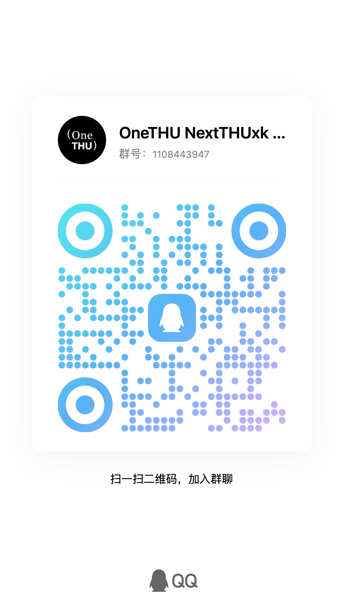

> 最后更新：2026-09-22 22:56

<div align="center">


**One THUer should have OneTHU.**

`One App · One Identity · One Campus`

[官网](https://onethu.github.io/)　·　[下载最新版](https://github.com/smartThise/OneTHU/releases/latest)　·　[插件市场](https://onethu.github.io/#market)　·　[设计令牌](https://onethu.github.io/tokens.html)　·　[文档](docs/README.md)

</div>

---

**One THU in OneTHU.**

OneTHU 是对 thu-info-app / learnX / NextTHUxk 的完全重构：统一身份、统一数据层、统一界面的清华校园套件，覆盖 macOS / Windows / Android 端。

## 为什么是 OneTHU

- **一个身份** —— 登录一次，全校通行：网络学堂、信息门户、图书馆、校园卡共用同一次登录；二次验证支持。
- **处处一致** —— 所有页面读同一份数据、用同一套界面规范。
- **一个对话入口** —— OneTHU Harness：一句话完成查课表、查成绩、查电费、订座位，真正的校园助手或许就在眼前。
- **数据可靠** —— 所有结果同步自 Info 与 网络学堂系统。
- **全平台** —— macOS / Windows / Android 端安装包齐备，移动端功能与桌面端对齐。

## 功能总览（0.10.0）

- **统一身份**：统一认证账号登录一次，全部模块共用会话；双因素认证支持。
- **OneTHU Harness**：属于 THUer 的生产力 Agent——一键处理课表 / 成绩 / 考试 / 新闻 / 空教室 / 校园卡 / 电费 / 网费 / 图书馆座位与研讨间/ 网络学堂全部功能，人工智能赋能学习生活；桌面端与 Android 端功能一致
- **选课**：与 NextTHUxk 同源的教务选课查询与提交系统
- **网络学堂**：课程 / 作业 / 通知 / 文件下载
- **信息门户**：个人信息 / 课表 / 成绩（中英文成绩单）/ 学年汇总 / 倒计时 / 新闻 / 校历 / 空教室 / 教学评估 / 体测 / 卫生成绩
- **生活服务**：校园卡流水 / 宿舍电费（充值）/ 校园网 / 电子发票 / 银行代发 / 研究生收入
- **图书馆**：座位预约
- **体育场馆**：场馆/场次/余量查询 + 我的预约 + 退订（应用内不做预约提交——见「使用边界与声明」；维护窗口 01:00-02:00）
- **学生宿舍公共空间预约**：空间 / 房间 / 日期 / 场次一站式预约
- **移动端**：Android APK（arm64 / universal）

## 下载与上手

安装包见 [Releases](https://github.com/smartThise/OneTHU/releases)：macOS DMG / Windows EXE / Android APK；
也可以从 [官网](https://onethu.github.io/) 进入（含功能总览与**实时同步的插件市场**）。

1. 安装后用清华统一认证账号登录（支持双因素认证）；
2. 数据异常时点右下角**刷新按钮**重试。如果有问题，请及时在 Issue 中提出。

需要在不暴露真实姓名 / 学号 / 成绩的前提下演示界面时，用 `demo` 分支构建的
**OneTHU Demo**（脱敏版：登录与正式版完全一致，姓名与学号替换为化名、成绩为编造成绩，
课表 / 洗衣机 / 教室等非敏感数据仍为真实数据）。

## 使用边界与声明

- **体育场馆模块仅提供查询**（场馆 / 场次 / 余量 / 我的预约 / 退订），不提供应用内预约提交。**依据清华大学体育部场馆中心 2025 年 12 月 3 日发布的公告第七条第 12 款：如有用户通过脚本软件或插件等非正常途径预定场地，一经发现并核实，对该用户封禁预订权限 6 个月，并函告相关院系或单位。** 预约请通过应用内按钮前往官方网页完成。
- **严禁将本项目源码用于任何形式的自动预约 / 抢场**。该行为既违反体育部场馆中心预约须知，也违反本项目开源准则；由此产生的一切后果由使用者自行承担。
- 本项目为非官方的个人效率工具，与清华大学无关；所有数据均来自学校公开系统的网页接口，仅供个人学习与日常使用。

### 外部作业源（荷塘雨课堂 / TUOJ / Tyche / DSA OJ）

设置页「外部作业源」可把各平台的作业 DDL 合并进「全部作业」与「今日」，一处看全：
雨课堂、TUOJ（AI 版与经典版）、Tyche、DSA OJ。

- **只读**：只取「标题 + 课程 + 截止时间 + 来源」，不提交、不答题、不抓题目内容。
- **登录即可**：雨课堂用扫码或官方网页登录；TUOJ / Tyche 复用清华统一认证（TUOJ 也可配独立账密）；DSA OJ 用邮箱 + 密码（该站无统一认证）。登录成功后由应用从传输层自定义响应头（`x-onethu-set-cookie`）取回会话 Cookie，**无需手动爬 Cookie**。登录只在桌面端（Tauri）可用：浏览器预览读不到 `Set-Cookie`。
- **凭据存储**：`onethu.exthw.v1` 只存**密文**（WebCrypto AES-GCM；密钥由本机随机 salt + 固定串经 PBKDF2 派生）。⚠️ **这只是本地混淆，不是真正的安全** —— 密钥与密文同在本机 localStorage，能读存储的人仍可解出明文；它只避免凭据以肉眼可读的形式被顺手看到或随备份导出。请勿在共享设备上使用。
- **地址硬编码**：各平台的服务端地址写死在代码里（雨课堂 `pro.yuketang.cn`、TUOJ `ai.tuoj.thusaac.com` 与 `oj.cs.tsinghua.edu.cn`、Tyche `166.111.236.164:6080`、DSA OJ `dsa.cs.tsinghua.edu.cn`），不向用户暴露；Tyche 在校外需 WebVPN。
- 各平台接口均为逆向自其网页端的非官方用法，可能随对方改版失效；外部源拉取失败**不影响**网络学堂主流程。

---

以下内容面向开发者。

## 快速开始

环境要求：Node ≥ 20、pnpm、Rust toolchain（桌面/移动壳需 Rust 编译）；Android 构建另需 Android SDK + NDK。

```bash
pnpm install      # workspace 全量装依赖
```

### 日常开发

```bash
pnpm dev                                  # 纯浏览器预览（Vite dev server；浏览器直连校园网受 CORS 限制）
pnpm --filter @onethu/desktop tauri:dev   # 原生桌面壳开发模式（Tauri 2，改前端即时热更）
```

### 生产构建

```bash
pnpm build                                # 构建全部包；web 资产产出到 apps/desktop/dist
pnpm --filter @onethu/desktop tauri:build # 桌面安装包（macOS DMG / Windows EXE / Linux 包；会自动先跑 pnpm build）
pnpm --filter @onethu/desktop exec tauri android build --apk   # Android APK（arm64 / universal，需 SDK+NDK）
```

- 桌面产物：`apps/desktop/src-tauri/target/release/bundle/`
- Android 产物：`apps/desktop/src-tauri/gen/android/.../build/outputs/apk/`
- CI（`.github/workflows/release.yml`）打包命令与本地一致；sidecar 在目标平台现场构建，仓库不携带任何架构的二进制

### 仓库结构

```
OneTHU/
├── packages/
│   ├── core/        @onethu/core   统一 API 客户端                          
│   └── ui/          @onethu/ui     设计令牌与基础样式
├── apps/
│   └── desktop/     @onethu/desktop  桌面端 + Android（Tauri 2，Vite + React）
├── plugins/
│   └── OneTHU-Harness/              核心）
└── docs/                            品牌横幅、插件与接口规范、移动端通告等
```

### API 与插件开发

OneTHU 为开发者封装并开放丰富的统一平台调度接口，鼓励开发者利用 OneTHU API 创造更多可能。
为 OneTHU 编写插件（JS 模块 / Rust sidecar / Android 内嵌），见 [插件开发指南](docs/plugin-development.md) 与 [API 参考](docs/api-reference.md)。

## OneTHU Harness（OH）

大模型驱动的对话助手，助力您在清华的学习生活。

详见 **[plugins/OneTHU-Harness](https://github.com/smartThise/OneTHU-Harness)**。

## 致谢

核心 API 结论分别验证自 [thu-learn-lib](https://github.com/Harry-Chen/thu-learn-lib)、
[thu-info-app](https://github.com/thu-info-community/thu-info-app)、[learnX](https://github.com/robertying/learnX)、
thu-tok-auto、yuketang-helper-auto，向以上项目的长期维护者致敬。OneTHU 为个人使用的整合重构。

- **THU Info App / thu-info-lib**：数据层移植自上游，经 THU Info 团队**邮件授权**在非商业用途下
  二次分发（授权截止 **2036-12-31**，邮件原文存档于仓库）。
- **LearnX**：网络学堂子页与部分交互按其实现移植；其许可为 MIT **并附例外条件**（见下）。
- **thu-tok-auto**、**yuketang-helper-auto**（均为 MIT）：MadModel 与雨课堂侧的接口结论来源。

各项目的许可条件、授权范围与例外条款汇总在 [LICENSES/THIRD-PARTY.md](./LICENSES/THIRD-PARTY.md)。

## 许可

OneTHU 自有代码以 **MIT** 许可开源（见 [LICENSE](./LICENSE)），**并附两条限制**：

1. **严禁商业用途**；
2. **严禁用于对清华大学信息服务的攻击性访问**——包括编写或运行抢课、体育场馆/图书馆座位等
   自动预约提交的插件或脚本、高频批量请求、以及任何规避校方风控与身份校验的行为。

违反任一条，授权立即终止。第三方组件适用其自带许可，其中两点需特别注意：

| 来源 | 许可与限制 |
|---|---|
| [THU Info App / thu-info-lib](https://github.com/thu-info-community/thu-info-app) | 上游 BSL 1.1；THU Info 团队邮件授权 OneTHU **非商业用途**二次分发，**截止 2036-12-31** |
| [LearnX](https://github.com/robertying/learnX) | MIT，但**附带例外**：若您过去或现在任职清华大学信息化技术中心，或您的项目受任何与清华有关的机构资助，则未经授权的使用（含拷贝、修改、再分发，无论是否商用）视为侵权 |
| thu-tok-auto / yuketang-helper-auto | MIT |
| cheerio·iconv-lite·sm-crypto·mammoth·xlsx·katex 等 | 各自自带许可（MIT / Apache-2.0 等） |

完整条款见 [LICENSES/THIRD-PARTY.md](./LICENSES/THIRD-PARTY.md)。

## 版本

当前版本 **0.10.0**（详见 [Releases](https://github.com/smartThise/OneTHU/releases)）。

## 用户交流群

扫码进 QQ 群：问题反馈、功能催更、使用技巧交流。

<p align="center">
  
</p>
